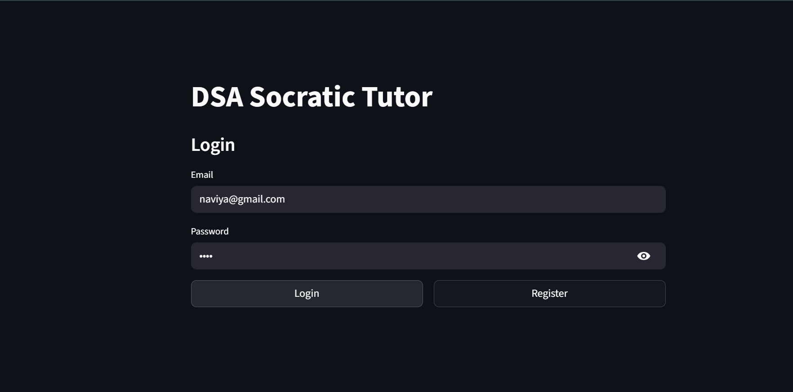
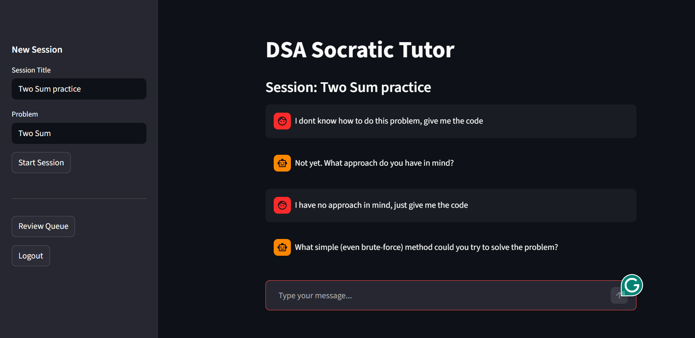
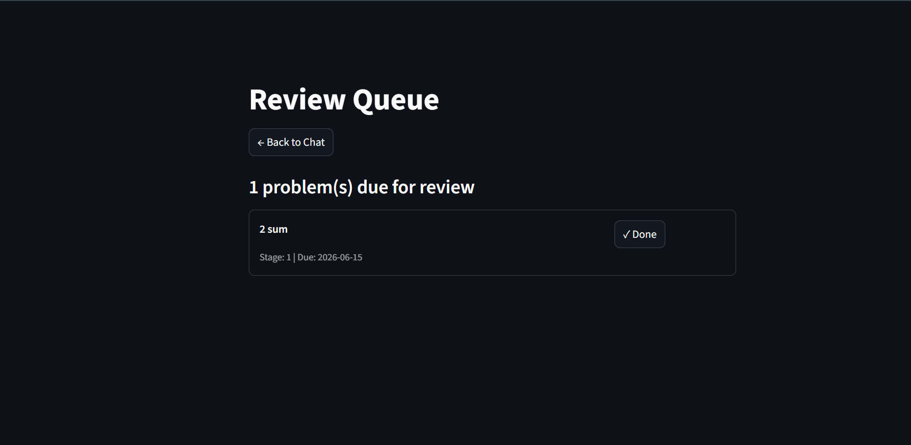

# DSA Socratic Tutor 

A full-stack AI-driven DSA tutoring system. Instead of giving direct answers, it uses a Socratic questioning approach to guide users toward solving problems themselves, with conversation memory, semantic search via RAG, and a spaced-repetition review tracker.

## Features

- **JWT Authentication** — secure register/login with bcrypt password hashing
- **Socratic AI Tutor** — Groq-powered chatbot that progressively escalates hints instead of giving solutions outright
- **Conversation Memory** — full session history is passed to the model on every message
- **Semantic Search / RAG** — sentence-transformers (all-MiniLM-L6-v2) embeddings + cosine similarity to retrieve relevant past problems and inject them as context
- **Spaced Repetition** — fixed-interval review ladder (1 → 2 → 5 → 10 → 25 days) to track problems due for revision
- **Streamlit Frontend** — interactive UI for chat, session management, and review queue

## Tech Stack

- **Backend**: FastAPI
- **Frontend**: Streamlit
- **Database**: PostgreSQL + SQLAlchemy ORM
- **Auth**: JWT (python-jose) + passlib/bcrypt
- **LLM**: Groq API (openai/gpt-oss-120b)
- **Embeddings**: sentence-transformers (local, all-MiniLM-L6-v2)

## How It Works

### Socratic Tutoring
When a user asks for help with a problem, the AI tutor doesn't give code immediately. It follows a structured flow:
1. Asks what approach the user has in mind
2. Asks the user to write out their approach, even roughly
3. Probes for time/space complexity understanding
4. Only after genuine effort (or repeated struggle) does it offer hints, then minimal snippets, then a full solution — followed by a request to explain it back

### Memory + RAG
Every message sent includes the full conversation history for that session, so the model has context of what's been discussed. Additionally, the user's message is embedded and compared (via cosine similarity) against previously stored problem descriptions. If a sufficiently similar past problem is found (similarity > 0.4), it's injected into the system prompt as extra context — connecting a new problem to one tackled in an earlier session.

### Spaced Repetition
Users can mark problems for review via `/review/add`. Each item starts at stage 0 (due immediately). Completing a review advances it to the next interval in the ladder `[1, 2, 5, 10, 25]` days, mimicking a basic Anki-style scheduling system.

## Screenshots

**Login:**


**Chat — Socratic flow in action:**


**Review Queue:**


## Setup

1. Clone the repo and create a virtual environment:
```bash
   python -m venv .venv
   # On Windows:
   .venv\Scripts\activate
   # On Mac/Linux:
   source .venv/bin/activate
   pip install -r requirements.txt
```

2. Create a `.env` file with:
```env
   DATABASE_URL=postgresql://<user>:<password>@localhost/dsa_chatbot
   SECRET_KEY=<your-secret-key>
   GROQ_API_KEY=<your-groq-api-key>
```

3. Run the backend:
```bash
   uvicorn main:app --reload
```

4. Run the frontend:
```bash
   streamlit run app.py
```

5. Open `http://localhost:8501` for the Streamlit UI, or `http://localhost:8000/docs` for interactive API documentation.

## Example: Send a Message

**Request** — `POST /chat/session/{id}/message`
```json
{
  "content": "I have an array and need to find two numbers that add up to a target. How should I approach this?"
}
```

**Response**
```json
{
  "response": "What approach do you have in mind to solve this problem?"
}
```

## API Overview

- `POST /auth/register`, `POST /auth/login` — user authentication
- `POST /chat/session` — create a new chat session
- `POST /chat/session/{id}/message` — send a message, get Socratic AI response
- `GET /chat/session/{id}/history` — retrieve session history
- `GET /chat/all-sessions` — list all sessions for a user
- `POST /rag/add`, `GET /rag/search` — manage and query the embedding store
- `POST /review/add`, `GET /review/due`, `POST /review/{id}/complete` — spaced repetition review queue

## Roadmap

- React frontend (replace Streamlit)
- Docker + CI/CD
- pgvector for production-scale similarity search
- Interview mode
- Deployment (Render)

## Known Issues / v2

- Resource suggestions occasionally mismatched to problem type (prompt engineering fix pending)
- Embeddings stored as JSON strings in PostgreSQL — planned migration to pgvector for indexed similarity search at scale